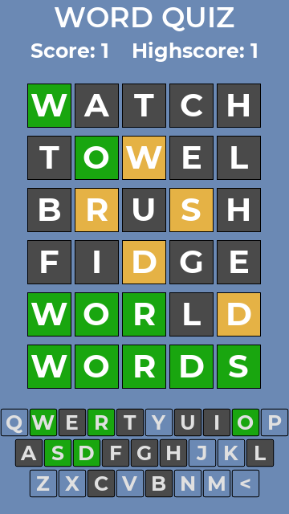

# Word Quiz

Word Quiz is a game inspired by [Wordle](https://www.nytimes.com/games/wordle/index.html) and is built using the [Godot Engine](https://www.godotengine.org) (Version 3.5). It was created to let people play this type of game in other languages than English. The game has no limit in plays, so you can guess words as long as you like. There are also binaries, so it can be played offline and outside the browser.
Exported binaries and online play can be found [here](https://levelbreaker.itch.io/word-quiz).

## Languages
Currently, supported languages are: German, English, French, Italian. But I plan to add more from time to time.
New languages can be easily added with the help of the Python Scripts in the `wordlistProcessing` folder to sort and format word lists. Native Speakers and others who know a language well are welcomed to help translate the game for everyone!
